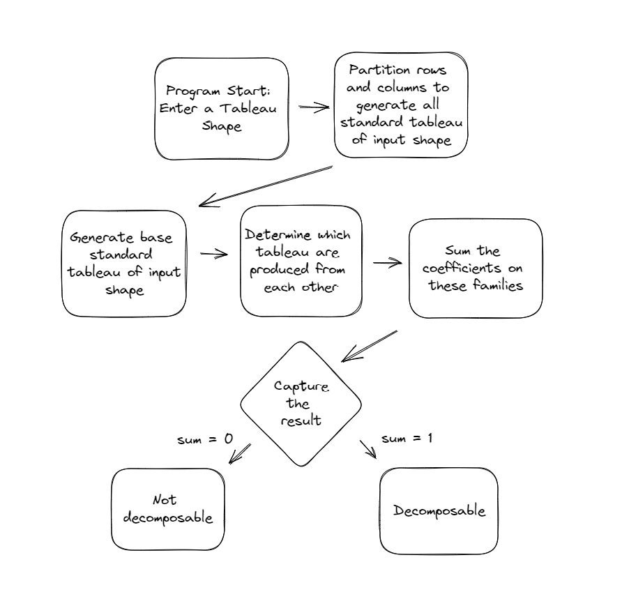
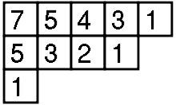
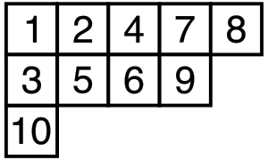
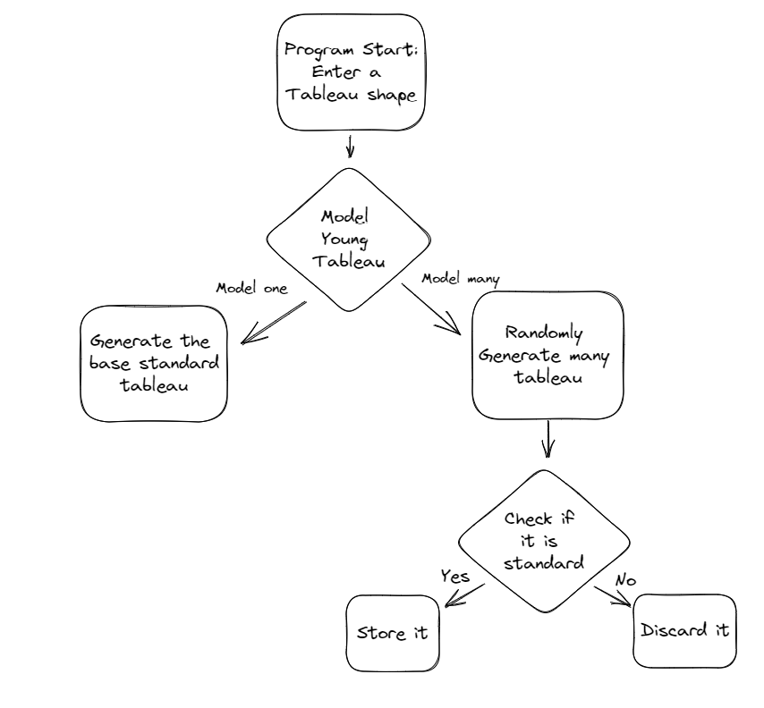
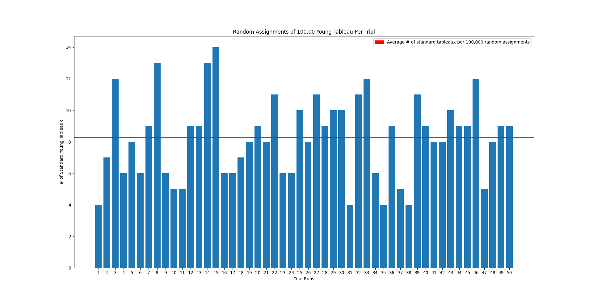

### Introduction

Young tableaux are a powerful tool for representation in the field of combinatorial mathematics. More specifically, these tableaux serve a significant role in describing group representations of both symmetric and linear groups, as well as studying their properties. The properties in question are what this proposed research project aims to investigate. Using modern, industry standard programming techniques and languages, a particular property of a certain symmetric group, that has otherwise been elusive, aims to be discovered. This being, the decomposability of Specht modules.

#### Motivation

Previous research surrounding the discovery of decomposable Specht modules was initially quite swift [2]. However, over the past few decades the progress towards uncovering these symmetric groups with these special properties has slowed down substantially. So much so, that almost none have been found since the late twentieth century [2]. The major reason for this can be inferred to be the computational overhead required to explore this particular sect of mathematics. The traditional process of finding a decomposable Specht module from start to finish is a lengthy one that, if formalities are desired, can potentially take countless hours to complete, even for the small computations. This overhead creates a void that seems to be able to be filled through the use of programming. An attempt has been made to bridge this gap, but it only managed to recompute the work that has already been done due to the use of interpreted languages and slow algorithms [1].

#### Goals of the Project

Filling the void with more modern and efficient programming strategies is what the proposed research seeks to accomplish. It is known that compiled languages are significantly faster than interpreted languages. In fact, this increase in speed can range from five to ten times faster when comparing certain interpreted languages to their compiled counterparts [4]. This key insight is what will be the heart of this project, as the main reason the previous attempt fell short was due to its use of Python, a well known and popular interpreted language that can excel in mathematical scripting because of its unique features. On top of this, there were also inefficient algorithm implementations which hindered the tool’s performance, especially when computations got large. This research will remedy these issues by overhauling the previous attempt at programmatically solving this decomposable mystery.

The general objective is to expand upon previous results, but before that expansion can be done, a basic understanding of the process of finding these decomposable Specht modules must be understood. To achieve this, the work completed prior was used to create an outline of the process at a high level, so the problem could be broken down into smaller, easier to understand pieces. Each piece provides a crucial role in the functionality of the envisioned tool. Figure 1 depicts how the tool this research aims to create will operate generally. Some of the components of this flowchart are trivial in terms of their programmatic implementation, while others are the reason for the previous attempt’s shortcomings.



+ Figure 1: Flowchart that outlines the proposed tool at a high level [1].

In the end, the tool founded by this research will implement the general idea presented in Figure 1. To do this, the partitioning process, as well as the step that involves determining tableau productions will need to be made more efficient through the use of new methods, different from those previous. This, in combination with programming the tool in a compiled language instead of an interpreted one, will create a useful piece of software that combinatorial mathematicians can use to explore and discover new, never before found, decomposable Specht modules.

### Related Work

Specht modules, and specifically the decomposability of them, is a wholly understudied area of combinatorial mathematics. Only a handful of papers have been published that cover this topic compared to most other mathematics research. Within those few papers; however, significant strides have been made that aim to lead to the discovery of all possible decomposable Specht modules, especially in recent years.

#### Foundations

Initial work regarding Specht modules dates back to the pre World War 2 era, specifically 1935. During this time, Wilhelm Specht studied symmetric groups in great detail. Eventually, Specht ended up making a discovery that set a specific symmetric group apart from the others, he deemed this group Specht modules [5]. During this time, a new discovery like this did not go unnoticed, and much work was done regarding these groups to prove their usefulness. It was not until the late twentieth century that the decomposability of Specht modules was discovered by Gwendolen Murphy [3]. In his work, he further explored this property and ended up classifying families of Specht modules, many of which turned out to be decomposable as well [3]. 

#### Recent Work

Within the last few years, some of the most noteworthy work has been completed regarding the discovery of families of decomposable Specht modules. For approximately three decades prior to the work of Craig Dodge and Matthew Fayers, little to no progress has been made in this area of mathematics [2]. Their research upset this trend massively, leading to new discoveries, as well as even seemingly forging a pathway for future work to expand in all directions regarding Specht modules. The proofs detailed in their work opened up doorways for other disciplines to intervene, and assist with these developments. 

Computing was the discipline of most importance that saw this opportunity. With the work of Aubrey Piper Collins and Craig Dodge, a piece of software was created that performs these computations and determines if Specht modules are decomposable[1]. Through the use of many Python algorithms, complex processes like partitioning and production deducing were able to be automated, and assembled together to create a working tool. However, this tool does not come without its limitations. Much like going through the process of finding these decomposable symmetric groups by hand is taxing, even for small computations, the tool created from their research met the same fate. It too, was limited by speed and computational power, and as a result, it only was able to compute decomposable Specht modules that were small and already discovered [1].

### Prototype

Taking into account the shortcomings of previous work, the realization was made that the tool would most likely need to be re-implemented from the ground up in almost every aspect. This includes the programming language it is written in, but also other crucial programming structures as well. For example, the data structure that contains all of the information that describes a tableau, and therefore an entire Specht module, would need to be refactored at some point to allow for more efficient evaluations and manipulations. This, however, was deemed a later issue. The already implemented tool was quite complex as it was, so implementing an entirely new tool is a big ask. The first step was to start with the basics; modeling. A prototype was built in Python, for simplicity, from the ground up, redesigning the process of modeling and, later, generating Young tableau as a means of gauging overall project feasibility. A Young tableau is a filling of a certain configuration of boxes from {1, 2, …, n} [6]. Below portrays an example of one on the left in Figure 2.



+ Figure 2: A Young tableau of shape (5,4,1)  



+ Figure 3: A standard Young tableau of shape (5,4,1)

On the right in Figure 3 is a standard Young tableau. What differentiates a normal Young tableau from a standard one is that the numbers inside of a standard’s boxes are strictly increasing in the rows and columns top-down, left-to-right [6]. These features are necessary to withhold when modeling these structures in code. A diagram to outline the prototype’s implementation is below in Figure 4. 



+ Figure 4: Prototype design diagram.

Based on the look of the structure of Young tableau in Figures 2 and 3, the simplest way to store and model these would be using two-dimensional arrays. Storing the data this way made creating, manipulating, and interacting with it significantly easier. Creation of these tableau is an important step that takes place in potentially two different cases. One of which generates the base standard tableau, as seen in Figure 5, while the other creates a Young tableau with random number placements using Python’s built-in random package, as seen in Figure 6.

```python
# fill in the tableau with standard values defined by the shape
            for i, _ in enumerate(self.shape):
                # special case if the tableau is empty -- add the initializing row
                if self.tableau == []:
                    row = list(range(1, self.shape[i]+1))
                    self.tableau.append(row)
                # all other cases -- add remaining rows
                else:
                    start = self.tableau[i-1][-1] + 1
                    end = start + self.shape[i]
                    row = list(range(start, end))
                    self.tableau.append(row)
```

+ Figure 5: Algorithm for generating the base standard Young tableau.

```python
# generate the random values
            vals = []
            while len(vals) != sum(shape):
                num = randint(1, sum(shape))
                if not(num in vals):
                    vals.append(num)
            # fill in the tableau with the random values
            for i, _ in enumerate(self.shape):
                if self.tableau == []:
                    start = 0
                    end = start + self.shape[i]
                else:
                    start = vals.index(self.tableau[i-1][-1]) + 1
                    end = start + self.shape[i]
                row = vals[start:end]
                self.tableau.append(row)

```

+ Figure 6: Algorithm for generating a Young tableau with random value placements.

After being able to model Young tableau, both standard and non-standard, the next step was to explore the possibility of detecting whether a tableau was standard or not. Another algorithm was implemented to do this. It was fairly trivial and only involved using Python’s built-in sorted method to check if the rows and columns were sorted. Fully implementing these algorithms completed the prototype. Its completion managed to provide an answer for many questions regarding this project’s feasibility. It saw to it that exploring this area of mathematics in code was possible, that modeling Young tableau, both standard and non-standard was possible, and that rebuilding a tool from the ground up would also be possible. But there was more to gain from this prototype than just the insights gathered from its creation. More questions could be answered.

### Experiments

The basis of the experimental process was to explore the utility of the created prototype and what it could be used for to gain more insights into the future of this proposed research project. Throughout the development of this idea, both in the literature review and in the prototype’s implementation, issues with generating these tableaux were glaring. The process was slow, as permutations are expensive, especially when so much memory is being used to track the location of elements in two-dimensional arrays. The experiment performed sought to explore a potential solution to this inefficiency through the use of the already existing random value placement.

#### Experimental Design

To test this potential solution, a random assignment experiment was conducted. The algorithm outlined in Figure 6 was leveraged to generate large amounts of Young tableau of.shape (5,4,1). This was done to ensure that a big enough sample size was collected to ensure the results were as valid as possible. Each one of these generated Young tableau were run through the aforementioned algorithm that detects if a tableau is standard or non-standard. Multiple trials were performed to get even more accurate results from the experiment.

The results were logged through a counting variable that kept track of the number of standard Young tableau encountered. After all of the Young tableau were generated, some other diagnostics were collected, and some manipulations were applied to visualize the experimental results.

#### Evaluation

The results from fifty trial runs, which generated one-hundred thousand each trial, totaling five million generated Young tableau were not in favor of random assignment as a means to replace permutations. Although the generation of five million Young tableaux was not time consuming or memory intensive, the strategy simply did not produce enough standard Young tableaux to justify its use case. Figure 7 showcases a bar chart that helps to visualize the data.



+ Figure 7: Chart that outlines the experimental results from 50 trial runs.

The distribution in Figure 7 is evident of the method being tested in the experiment, in that it is clearly random. There is a lack of consistency across each of the fifty trials. Some runs had as little as 4 standard Young tableaux out of 100,000 generations, while others had as high as 14 standards. The average number of standard Young tableaux generated per trial was approximately 8.3, while the total number of standards generated from five million generations was 413. This number is concerning as the total number of standard Young tableau of shape (5,4,1) is 288, meaning that it took five million generations to total not even double the number of standards there are of shape (5,4,1). This also does not account for any duplicates that could have been generated. Suffice to say, random assignment turned out to be a very inefficient method for generating all of the standard Young tableaux required for this project’s vision.

### Threats to Validity

The results gathered from the experiment are at some risk of being invalid. In the grand scheme of things, the experiment conducted was fairly lightweight. All that was involved was counting the number of standard Young tableaux that were made. The simplicity of this experiment could potentially indicate that randomness is not entirely invalid as a potential replacement for the memory intensive, and time consuming process of permuting. Adding more factors to consider, and making the experiment more in depth could have brought these differences to light, and yielded better, more promising results. 

### Conclusion

#### Summary of Results

The potential for the expansion and creation of a tool that allows for the discovery of special decomposable symmetric groups, known as Specht modules, was shown in this work. In the literature review, previous results and inquiries showed a clear path that leads directly to much desired answers. In regards to the prototype that was built, all questions sought to be answered by its creation were answered. It was clearly shown that work in this field, as well as the work to create a larger scale tool is possible. The results of the experiment clearly outlined a direction that is not worth exploring in the future.

#### Future Work

As for what is worth exploring in the future, implementing the explored features and algorithms in a compiled language would be the next step in creating the tool described by this prospective project. Much needed improvements to algorithms and strategies are also in line for what needs to be done. Rethinking the storage and management of Young tableau could potentially open up new possibilities for manipulating and working with this data. Discovering a newer and more efficient way to generate standards Young tableaux will also make a substantial impact towards the vision of the project. Finally, discovering a way to quickly define which tableaux produce each other will wrap up all of the needs for this project.

#### Conclusions

Work for the future is extensive, but the work completed here for this proposal shows it is more than possible to be completed. Decomposable Specht modules seem to be elusive, but they are not elusive enough to evade the spying eye of programming. Through the power of modern programming techniques and practices, more of these special symmetric groups are sure to be discovered. The work of mathematicians decades, nearly centuries ago will be expanded upon, and who knows what these discoverie could be utilized for in the future.

### References

[1] Collins, A. P., Dodge, C. J. (2019). On the classification of Specht modules with one-dimensional summands. Involve, a Journal of Mathematics, 12(8), 1399–1413. https://doi.org/10.2140/involve.2019.12.1399 

[2] Dodge, C. J., Fayers, M. (2012). Some new decomposable Specht modules. Journal of Algebra, 357, 235–262. https://doi.org/10.1016/j.jalgebra.2012.01.035 

[3] Murphy, G. (1980). On decomposability of some Specht modules for symmetric groups. Journal of Algebra, 66(1), 156–168. https://doi.org/10.1016/0021-8693(80)90117-9 

[4] Seco, J. C. (2014). Interpretation and Compilation of Programming Languages Part 1-Overview.

[5] Specht, W. (1935). Die irreduziblen darstellungen der Symmetrischen Gruppe. Mathematische Zeitschrift, 39(1), 696–711. https://doi.org/10.1007/bf01201387

[6] Zhao, Yufei. (2008). Young tableaux and the representations of the symmetric group. 

